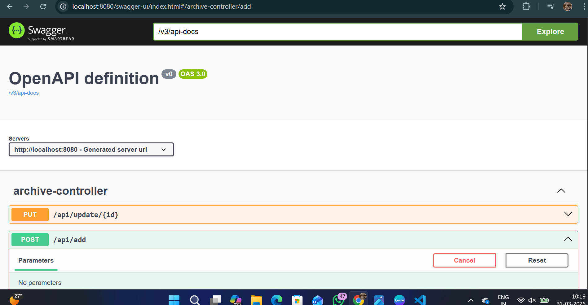
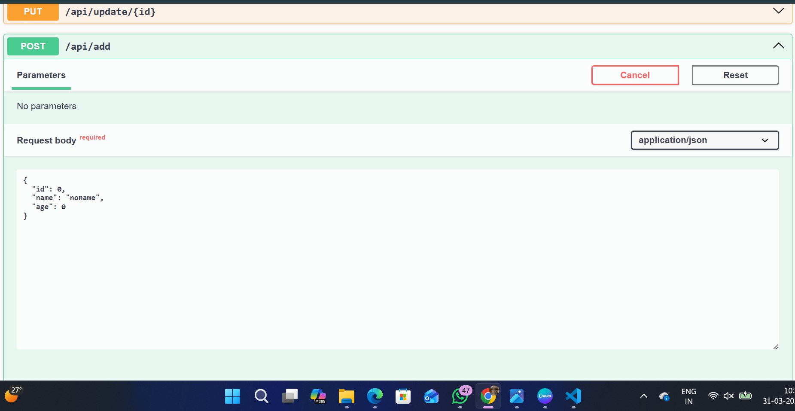
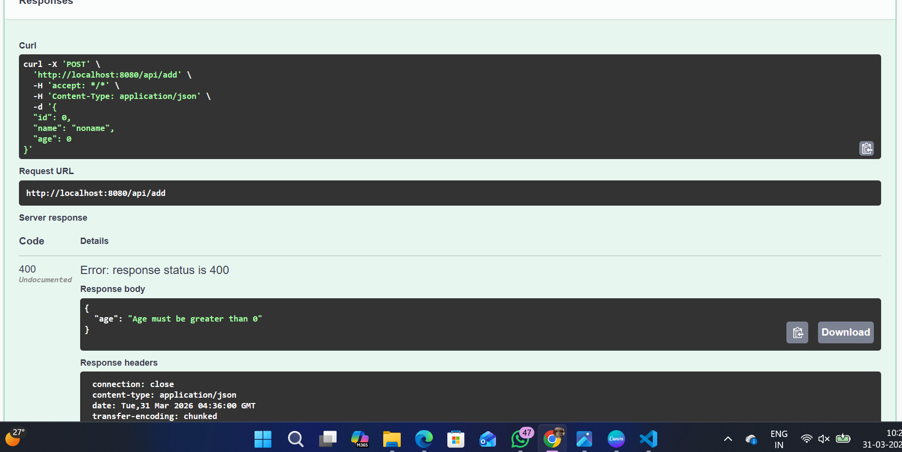

# 🏥 Patient Archive System

A Spring Boot REST API for managing patient records efficiently.

---

## 💡 Overview

This project is a backend system designed to manage patient data using REST APIs. It demonstrates CRUD operations, validation, and clean architecture.

---

## 🚀 Features

- Add patient
- View all patients
- Update patient
- Delete patient
- Search patients
- Input validation
- Error handling

---

## 🛠️ Tech Stack

- Java 17
- Spring Boot
- Spring Data JPA
- H2 Database
- Maven
- Swagger

---

## ▶️ How to Run

```bash
./mvnw spring-boot:run



## ✨ Contribution

This project is being actively improved.